# 📓 R. Note

A privacy-first encrypted notebook built with vanilla HTML, CSS, and JavaScript. No frameworks, no dependencies, no backend, no accounts.

[](https://rakibulislamnayan.github.io/restrictednotebook-js)
[](https://github.com/rakibulislamnayan/restrictednotebook-js)

***

## ✨ Features

| Feature | Details |
|---|---|
| Zero server, zero account | Fully client-side. Nothing is ever uploaded anywhere |
| AES-256 encryption | Real Web Crypto API encryption, no custom algorithm |
| PBKDF2 key derivation | 250,000 iterations to resist brute-force attacks on a leaked file |
| Custom .rna file format | Encrypted notebooks download as a portable `.rna` file |
| Hidden signature verification | Detects wrong passwords and corrupted files without storing the password |
| Notebook-style editor | Cream paper, ruled lines, red margin, spiral binding |
| Dark mode | Full nighttime writing theme, remembers your preference |
| Live stats | Word count, character count, estimated reading time |
| Panic Lock | Instantly wipes visible content and returns home |
| Drag & drop upload | Or browse to select a `.rna` file |
| Fully offline capable | Works without internet after the first load |
| Accessible | Keyboard navigation, focus indicators, ARIA labels |

***

## 🚀 Live Demo

👉 [Try it here](https://rakibulislamnayan.github.io/restrictednotebook-js)

***

## 📸 Screenshots

Below is the full list of screenshots used in this README, in the order they appear. Save each one with the exact filename shown so the images render correctly.

| Screenshot file name | What to capture |
|---|---|
| `screenshot-home.png` | The homepage: title, subtitle, New Notebook and Upload RNA File buttons, privacy note |
| `screenshot-editor-light.png` | New Notebook screen in light mode, with some sample text written in the notebook |
| `screenshot-editor-dark.png` | Same New Notebook screen after toggling Dark Mode |
| `screenshot-password.png` | Close-up of the password field with Show/Hide toggle, before clicking Encrypt |
| `screenshot-encrypt-success.png` | The success status message after clicking Encrypt & Download RNA |
| `screenshot-upload-dropzone.png` | The Upload screen showing the empty drag and drop area |
| `screenshot-upload-loaded.png` | The Upload screen after a `.rna` file has been dropped in, showing the filename and password field |
| `screenshot-unlock-wrong.png` | The error message shown after entering an incorrect password |
| `screenshot-unlock-success.png` | The unlocked notebook view, showing the restored title and content |
| `screenshot-panic-lock.png` | The Panic Lock button, ideally captured mid-flash or just before clicking |
| `screenshot-stats.png` | Close-up of the live word count, character count, and reading time card |

***

### Homepage

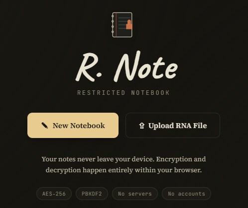

### Writing a notebook

Light mode and dark mode, side by side in spirit, both built on the same notebook layout.

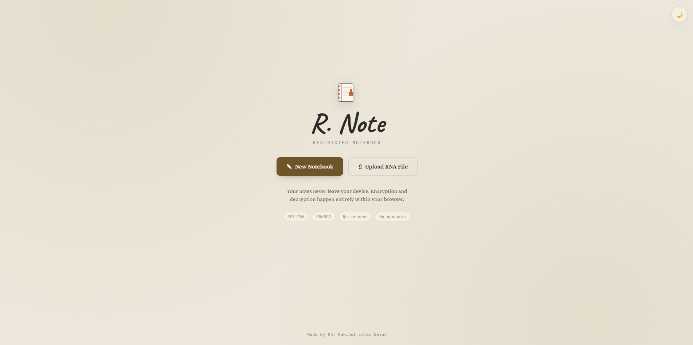

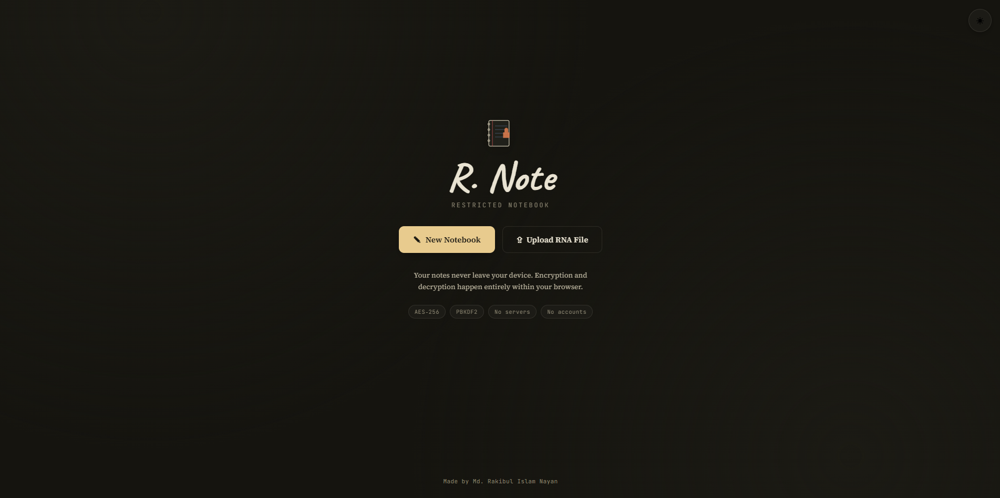

### Setting a password

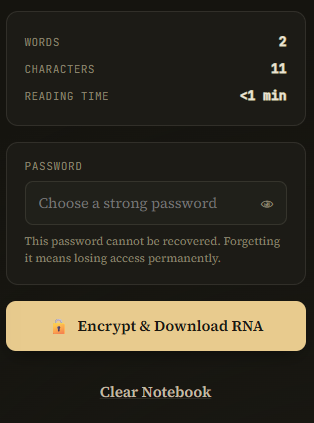

### Encrypting and downloading

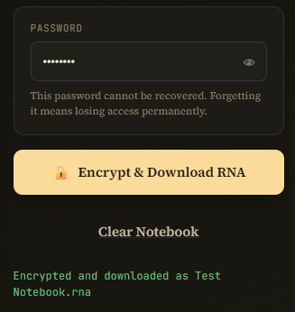

### Uploading a notebook back

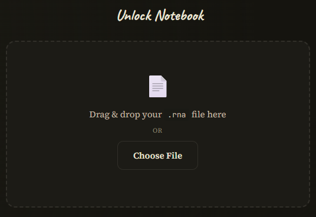

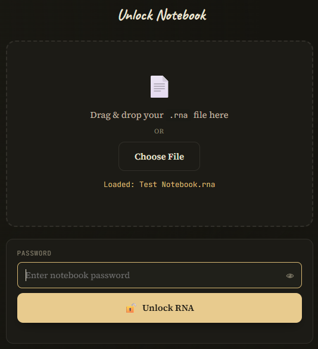

### Unlocking

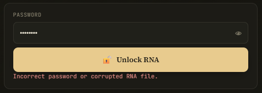

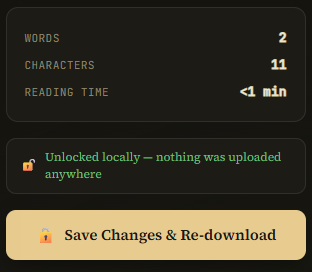

### Panic Lock

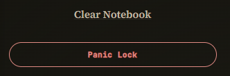

### Live writing stats

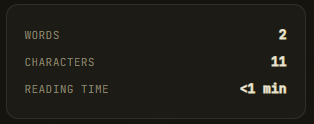

***

## 🕹️ How to Use

1. Click **New Notebook** to start writing, or **Upload RNA File** to open an existing one
2. Write your notes in the notebook style editor
3. Enter a password and click **Encrypt & Download RNA**
4. The notebook downloads as a `.rna` file: unreadable to anyone without the password
5. To reopen it later, upload the same `.rna` file and enter the correct password
6. Use **Panic Lock** anytime to instantly clear the screen and return home

***

## 🔐 How the Encryption Works

### File format

Each `.rna` file is a JSON envelope containing:

```json
{
  "format": "RNA",
  "version": 1,
  "salt": "...",
  "iv": "...",
  "ciphertext": "..."
}
```

### Key derivation

The password is never stored or transmitted. Instead, **PBKDF2** derives a 256-bit AES key from the password and a random salt, using 250,000 iterations of SHA-256. A unique salt is generated for every encryption, so the same password produces a different key each time.

### Encryption

The notebook content is encrypted using **AES-256-GCM** with a randomly generated IV (initialization vector). GCM mode also provides built-in authentication, meaning any tampering or wrong password causes decryption to fail safely rather than silently returning garbled data.

### Hidden signature system

Before encryption, a hidden marker (`RNA_NOTEBOOK_V1::`) is prepended to the notebook content. After decryption, the app checks for this marker:

- **Marker found** → password was correct, notebook is restored
- **Marker missing or decryption fails** → "Incorrect password or corrupted RNA file"

This signature is never shown to the user and exists purely to verify password correctness without ever storing the password itself.

***

## 🛠️ Tech Stack

| Technology | Usage |
|---|---|
| HTML5 | App structure, semantic markup, accessibility |
| CSS3 | Notebook design, spiral binding effect, dark mode theming |
| Vanilla JavaScript | UI logic, file handling, state management |
| Web Crypto API | AES-256-GCM encryption, PBKDF2 key derivation |
| localStorage | Dark mode preference only, never notebook content |

***

## 📂 Project Structure

```
restrictednotebook-js/
├── index.html        ← app structure and screens
├── style.css          ← notebook design and dark mode
├── script.js           ← encryption engine and UI logic
├── README.md          ← this file
└── screenshot-*.png   ← all screenshots listed above
```

***

## ▶️ Run Locally

```bash
git clone https://github.com/rakibulislamnayan/restrictednotebook-js.git
cd restrictednotebook-js
open index.html
```

***

## 🌐 Deploy to GitHub Pages

1. Push this repo to GitHub
2. Go to **Settings → Pages**
3. Set source to `main` branch, `/ (root)`
4. Live at `https://rakibulislamnayan.github.io/restrictednotebook-js`

***

## 📌 What I Learned

| Topic | Details |
|---|---|
| Web Crypto API | Real AES-256-GCM encryption directly in the browser |
| PBKDF2 | Deriving secure keys from passwords with salted iterations |
| Authenticated encryption | Why GCM mode fails safely on tampering or wrong passwords |
| Privacy-first architecture | Designing an app that never touches a server by principle, not just by accident |
| Signature based verification | Confirming password correctness without ever storing the password |
| CSS illustration | Building a realistic notebook look with spiral binding and ruled lines using pure CSS |
| Accessible UI | Keyboard navigation, focus states, and ARIA labelling throughout |

***

## 📬 Connect

Made by **Md. Rakibul Islam Nayan** · [LinkedIn](https://www.linkedin.com/in/rakibul-islam-nayan/) · [GitHub](https://github.com/rakibulislamnayan)

> If you like it, please ⭐ star the repo. It means a lot!
